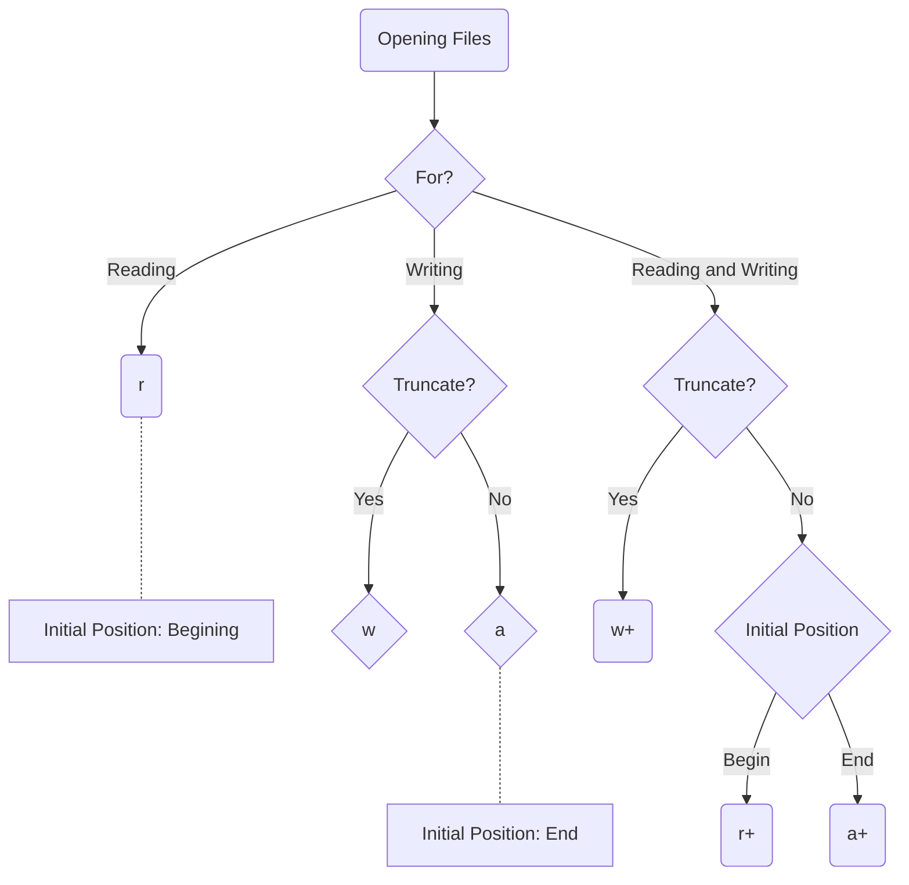

# Python3

### 模块的导入方式
* 模块 <br />
一个模块可简单认为就是一个 python 文件。
    * 模块的构成 <br />
    模块由变量、定义、函数、可执行代码组成。其中，无论采取哪种引入方式，都会在第一次引入模块时，执行被引入模块的可执行代码。
    * \_\_name\_\_ 属性与模块的可执行代码 <br />
    每个模块都有一个\_\_name\_\_ 属性，如果模块是被直接运行，\_\_name\_\_ 的值为\_\_main\_\_，如果模块是被导入的，\_\_name\_\_ 的值为模块名（不包含.py扩展名）。因此，我们可以使用 \_\_name\_\_ 属性和 if-else 分支语句来控制模块可执行代码的分别执行。
    
* 包
    * 包的基本结构
        ```
        sound/                          顶层包
            __init__.py               初始化 sound 包
            formats/                  文件格式转换子包
                    __init__.py
                    wavread.py
                    wavwrite.py
                    aiffread.py
                    aiffwrite.py
                    auread.py
                    auwrite.py
                    ...
            effects/                  声音效果子包
                    __init__.py
                    echo.py
                    surround.py
                    reverse.py
                    ...
            filters/                  filters 子包
                    __init__.py
                    equalizer.py
                    vocoder.py
                    karaoke.py
                    ...
        ```
        目录只有包含一个叫做 \_\_init\_\_.py 的文件才会被认作是一个包.
* 模块的搜索路径 <br />
当前目录，环境变量 PYTHONPATH 指定的目录，Python 标准库目录， pth 文件中指定的目录。

| 方式 | 实际效果|
| :-: | :-: |
| import 模块名 | 只是将模块名导入符号表，并没有将模块中的定义、变量和函数导进本文件，在本文件调用模块中的内容时也只能通过“模块名.”的方式。 |
| from 模块名 import* | 会将模块中的所有内容（定义、变量和函数）全部导入本文件（但是那些由单一下划线（_）开头的名字不在此例），意即可能会与本文件中的内容会产生命名冲突。 |
| from 模块名 import 变量/定义/函数  | 仅引入模块中对应的变量/定义/函数，使用时，直接使用该变量/定义/函数名，无需通过“模块名.”的方式。注意，此时模块名并没有放进当前文件的符号表。 |
| import 包.子包.模块名 | 会将包.子包.模块名导入该文件的符号表，调用该模块中的内容时需使用“包.子包.模块名.函数/定义/变量”的形式。 |
| from 包.子包 import 模块名 | 会将模块名导入该文件的符号表，使用该模块中的内容时，采用“模块名.”的方式。 |
| from 包.子包.模块名 import 函数/变量/定义 | 会将模块名导入该文件的符号表，将 import 的函数/变量/定义导入本文件，可直接按其名调用，除此之外的该模块内容调用，采用“模块名.”的方式。 |
| from 包 import * | 首先看包直接目录下的 \_\_init.py\_\_文件中的 \_\_all\_\_ 列表是否为空，如果为空，则不会导入任何子模块，具体导入的是什么目前不太清除。如果 \_\_all\_\_ 列表不为空，则把这个列表中的名字作为包内容导入。 |

注意当使用 import item.subitem.subsubitem 语法时，除了最后一项，都必须是包，而最后一项则可以是模块也可以是包，但不可以是类，函数或者变量的名字。


### print 函数
* print 函数在打印多个参数时，会默认在每个参数之间添加一个空格作为分隔。


### python 文件操作


### python 虚拟环境创建
* 创建流程（以开发 Django 项目为例）
        ```bash
        # 本机上，还有如下预操作
        # sudo apt install python3.12-venv
        # 创建环境并激活
        python3 -m venv .venv
        source .venv/bin/activate

        # 安装Django
        (.venv) pip install django==3.2.12

        # 创建Django项目
        (.venv) django-admin startproject my_site

        # 运行测试
        (.venv) cd my_site
        (.venv) python manage.py runserver

        # 完成后退出环境
        (.venv) deactivate
        ```
* 几条有趣的命令
        * 虚拟环境下配置 pip 源 <br />
        `pip install -i https://pypi.tuna.tsinghua.edu.cn/simple package_name`
        * 安装 pip <br />
        `sudo apt install python3-pip`
        * 导出虚拟环境依赖 <br />
        `pip freeze > requirements.txt`
        * 从文件安装依赖
        `pip install -r requirements.txt`

### python3 正则表达式
python3 正则表达式通过引入模块 re 来实现，主要提供四种操作：两种匹配操作，按匹配子串的个数来说，匹配操作既有可选的仅需匹配一次，也有可选的全部匹配；按匹配的原字符串范围来说，又分为 match 和 search 两类；按调用匹配的方式来看，又可以细化为两种方式。此外的操作还有：一种替换操作，一种分割操作。
* 匹配操作
  * 仅需匹配一个子串
    * 调用 match 和 search 的方式一： 
      | 函数 | 描述 | 作用 |
      | :-: | :-: | :-: | 
      | re.match(pattern, string, flags=0) | 1. pattern 表示正则表达式模式 <br /> 2. string 表示要匹配的字符串 <br /> 3. flags 标志位，用于控制正则表达式的匹配方式，如：是否区分大小写，多行匹配等 | 该函数尝试从字符串的开始位置匹配一个模式，如果不是起始位置匹配成功的话， match() 就返回 None。如果匹配成功的话，则返回一个 re.Match 类对象。 |
      | re.search(pattern, string, flags=0) | 同上一条目 | re.search 扫描整个字符串并返回第一个成功的匹配，即 re.Match 类对象，否则返回 None。 |
    * 调用 match 和 search 的方式二：
      | 函数 | 描述 | 作用 |
      | :-: | :-: | :-: |
      | re.compile(pattern[, flags]) | 1. pattern 表示正则表达式模式。 <br /> 2. flags 可选，表示修饰符。 | 会返回一个 re.Pattern 类对象，供 match(), search() 和 findall() 三个函数使用 |
      | re.compile(pattern[, flags].match(string)) | string 为匹配的字符串 | 相当于调用 re.match，但是 flags 参数已经指定。 |
      | re.compile(pattern[, flags].match(string, beginIndex, endIndex)) | beginIndex: 进行字符串匹配开始的位置；endIndex：进行字符串匹配结束的后一个位置 | 相当于在 string 的 [beginIndex, endIndex) 范围内进行 match 操作。 |
      | re.compile(pattern[, flags].search(string)) | 所见即所得 | 所见即所得 |
      | re.compile(pattern[, flags].search(string[, pos[, endpos]])) | 所见即所得 | 所见即所得 |
      | re.compile(pattern[, flags].findall(string[, pos[, endpos]])) | 可以参考 re.findall 函数 | 可以参考 re.findall 函数 |
  * 需要匹配所有子串


