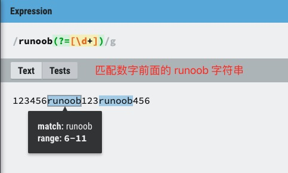

## 正则表达式
### 元字符
#### 量词
| 量词 | 作用 |
| :-: | :-: |
| * | 匹配前面的模式零次或多次 |
| + | 匹配前面的模式一次或多次 |
| ? | 匹配前面的模式一次或零次 |
| {n} | 匹配前面的模式恰好 n 次 |
| {n,} | 匹配前面的模式至少 n 次 |
| {n, m} | 匹配前面的模式至少 n 次且不超过 m 次 |
#### 字符类
| 字符类 | 作用 |
| :-: | :-: |
| [ ] | 匹配括号内的任意一个字符，如 [A-Z] |
| [^ ] | 匹配除了括号内的字符以外的任意一个字符 |
| - | 在字符类中表示范围 |
#### 边界匹配
| 符号 | 作用 |
| :-: | :-: |
| ^ | 匹配字符串的开头 |
| $ | 匹配字符串的结尾 |
| \b | 匹配单词边界，假如需要匹配单词 Chapter，那么正则表达式 /\bCha/ 将匹配到 Chapter 这个单词的 Cha 部分。 |
| \B | 匹配非单词边界，假如存在匹配文本 Chapter 和 apt，那么正则表达式 /\Bapt/ 则匹配到 Chapter 中的 apt，而非单词 apt 中的 apt。 |
#### 分组和捕获
| 符号 | 作用 |
| :-: | :-: |
| ( ) | 用于分组和捕获子表达式 |
| (?: ) | 用于分组但不捕获子表达式 |
#### 特殊字符
| 符号 | 作用 |
| :-: | :-: |
| \ | 转义字符，用于匹配特殊字符本身 |
| . | 匹配任意字符（除了换行符和回车，即 \n 和 \r） |
| | | 用于指定多个模式的选择 |

### 普通字符
| 普通字符 | 作用 |
| :-: | :-: |
| \s | 匹配所有空白符，包括空白字符，空格，制表符，换页符和换行符 |
| \S | 非空白符，\S不会匹配换行符 |
| \w | 匹配字母、数字、下划线，等价于 [A-Za-z0-9_] |
| \W | 匹配任意非单词字符，等价于 [^a-zA-Z0-9_] |
| \d | 匹配任意一个阿拉伯数字（0到9），等价于 [0-9] |
| \D | 匹配任意非数字，等价于 [^0-9] |
| \cx | 匹配由 x 指明的控制字符。例如，\cM 匹配一个 Control-M 或回车符。x 的值必须为 A-Z 或 a-z 之一。否则，将 c 视为一个原义的 'c' 字符 |
| \f | 匹配一个换页符。等价于 \x0c 和 \cL |
| \n | 这里，n 就是字符 n，用于匹配换行符 |
| \n | 这里，n 为一个正整数，标识一个八进制转义值（对应于 ASCII 码）或一个向后引用。如果 \n 之前至少 n 个获取的子表达式，则 n 为后向引用。否则，则标识一个八进制转义值。 |
| \xn | 匹配 n，其中 n 为十六进制转义值。十六进制转义值必须为确定的两个数字。如 '\x41' 匹配 "A"；'\x041' 则等价于 '\x04' & "1"。正则表达式中可以使用 ASCII 编码。 |
| \num | num 是一个正整数，它表示引用前面第 num 个捕获组。有一个问题，在正则表达式模式中，该如何区分 \num 和 \n，因为 num 和 n 的字面值都是正整数。 |
| \nm | 标识一个八进制转义值或一个向后引用。如果 \nm 之前至少有 nm 个获得子表达式，则 nm 为向后引用。如果 \nm 之前至少有 n 个获取，则 n 为一个后跟文字 m 的向后引用。如果前面的条件都不满足，若 n 和 m 均为八进制数字 (0-7)，则 \nm 将匹配八进制转义值 nm。 一头雾水。 |
| \nml | 如果 n 为八进制数字（0-3），且 m 和 l 均为八进制数字（0-7），则匹配八进制转义值 nml。存在疑惑，\n 问题。 |
| \un | 匹配一个 unicode 字符，其中 n 是一个用  四个十六进制数字表示的 Unicode 字符。 |
| \r | 匹配一个回车符。等价于 \x0d 和 \cM |
| \t | 匹配一个制表符。等价于 \x09 和 \cl |
| \v | 匹配一个垂直制表符。等价于 \x0b 和 \cK |  

### 贪婪匹配和非贪婪匹配
* \* 和 + 限定符都是贪婪的，因为它们会尽可能多的匹配文字，只有在它们的后面加上一个 ? 就可以实现非贪婪匹配或最小匹配。如对于文本 \<h1\>RUNOOB-菜鸟教程\<h1\>，`<.*>` 正则表达式将匹配文本 \<h1\>RUNOOB-菜鸟教程\<h1\>。`<.*?>` 正则表达式将匹配文本 \<h1\>。
* 默认情况下，量词(*, +, ?, {})是贪婪的，会尽可能多地匹配字符。在量词后加 ? 可使其变为非贪婪（懒惰）模式：
    * *?: 零次或多次，但尽可能少
    * +?: 一次或多次，但尽可能少
    * ??: 零次或一次，但尽可能少
    * {n, m}?: n 到 m 次，但尽可能少

### 分组和选择
* 分组示例：  对于文本：123456runoob123runoob456  
正则表达式 /([1-9])([a-z]+)/ 将匹配 6runoob 和 3runoob。
* 分组注意事项：圆括号用于分组，但相关的匹配会被缓存，可用非捕获元 ?: 和 ?= 和 ?! 来消除会被缓存的副作用。
* ?=、?<=、?!、?<! 的使用
    | 符号 | 作用 | 示例 |
    | :-: | :-: | :-: |
    | exp1(?=exp2) | 查找 exp2 前面的 exp1 |  |
    | (?<=exp2)exp1 | 查找 exp2 后面的 exp1 |  |
    | exp1(?!exp2) | 查找后面不是 exp2 的 exp1 |  |
    | (?<!exp2)exp1 | 查找前面不是 exp2 的 exp1 |  |

###  修饰符（标记）
| 常用修饰符 | 注意事项 |
| :-: | :-: |
| i(ignore case) | 忽略大小写，模式格式：/abc/i |
| g(global) | 全局匹配，查找所有匹配项，而不是在第一个匹配后停止 |
| m(multiline) | 多行模式，改变 \^ 和 \$ 的行为，原先 \^ 和 \$ 匹配的是字符串的开头和结尾，若采用 m 修饰符，则 \^ 和 \$ 将匹配字符串中每行的开头和结尾。 |
| s(single line/dotall) | 单行模式，将使点号 . 匹配包括换行符在内的所有字符。 |
| u(unicode) | Unicode 模式，目前不清楚具体作用。 | 
| y(sticky) | 粘性匹配，目前不清楚具体作用。 | 
| x(extended) | 忽略模式中的空白和注释，使正则表达式更易读。如 /a b c/x 等同于 /abc/。 |
| (?i) | 启用忽略大小写，如 a(?!)bc 仅匹配 "aBc" 和 "abc"。 |
| (?-i) | 禁用忽略大小写，如 a(?i)b(?-i)c 仅匹配 "aBc" 和 "abc"。 |
| (?i:...) | 仅对括号内生效，如 a(?i:b)c 仅匹配 "aBc" 和 "abc"。 |

### 运算符优先级
1. 转义符号：\\
2. 括号：()
3. 量词：*, ?, +
4. 字符类：[]
5. 断言：如 \^ 和 \$
6. 连接：
7. 管道：|

### 一些语言内置通用字符簇
| 内置通用字符簇 | 描述 |
| :-: | :-: |
| [[:alpha:]] | 任何字母 |
| [[:digit:]] | 任何数字 |
| [[:alnum:]] | 任何字母和数字 |
| [[:space:]] | 任何空白字符 |
| [[:upper]] | 任何大写字母 |
| [[:lower]] | 任何小写字母 |
| [[:punct:]] | 任何标点符号 |
| [[:xdigit:]] | 任何16进制的数字，相当于 [0-9a-fA-F] |

